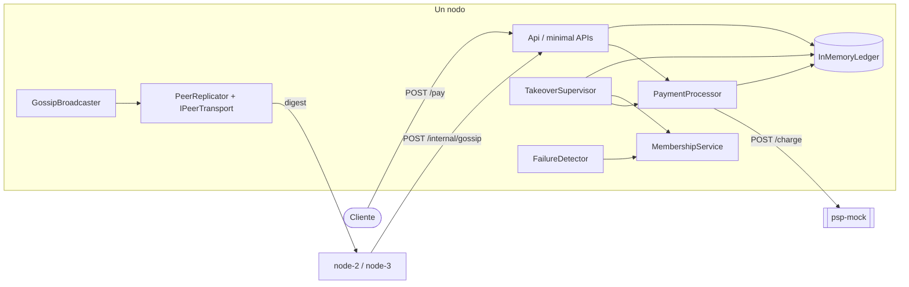
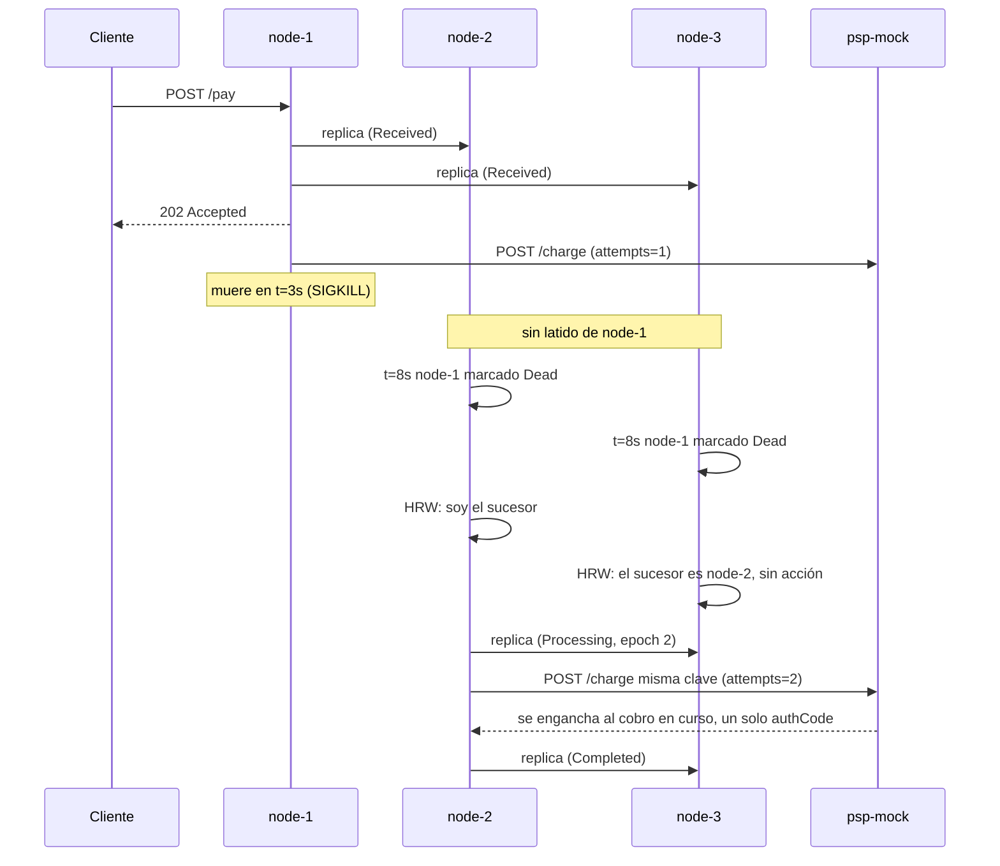

# SolidarityGrid

## 1. Qué es

SolidarityGrid es una prueba de concepto de una red de procesamiento
de pagos sin punto único de fallo. Tres nodos idénticos reciben y
procesan pagos contra un adquirente externo, sin broker de mensajes,
sin base de datos compartida y sin coordinador central: toda la
lógica de coordinación vive en el código de la aplicación.

Cuando un nodo muere a mitad de un pago, sus pares lo detectan, uno
de ellos asume la transacción huérfana y la lleva a término. El cobro
se aplica una sola vez, aunque el sistema haya tenido que intentarlo
más de una.

## 2. Cómo correrlo

Prerrequisitos: Docker con `docker compose` v2. El script de demostración necesita además un shell con `bash` y `curl` (Git Bash en Windows, o cualquier Linux/macOS); no usa `jq`. Para correr los tests fuera de Docker hace falta el SDK de .NET 8, que el repositorio fija con `global.json`.

### Levantar el clúster

```
docker compose up --build
```

Se construyen dos imágenes (una para los nodos, otra para el adquirente) y arrancan cuatro contenedores hasta quedar `healthy`. Cada nodo escribe al arrancar una línea como `[node-1] Nodo en linea. REST en :8080, HTTP/2 en :8081 (sin servicios gRPC).`. Los tres nodos publican su API REST en el host: node-1 en `8080`, node-2 en `8082`, node-3 en `8083` (el salto a `8081` no es un hueco: ese puerto lo ocupa el endpoint HTTP/2 de node-1 dentro de su contenedor, y no se publica). El contenedor `psp-mock` no publica puerto; vive solo en la red interna del compose.

El comando anterior queda en primer plano volcando los logs de los cuatro contenedores, que es parte de lo que interesa observar. Los siguientes `curl` van en una segunda terminal, con el clúster arriba:

```
# Aceptar un pago en node-1: responde 202 en milisegundos, sin esperar al banco.
curl -i -X POST http://localhost:8080/pay \
  -H 'Content-Type: application/json' \
  -H 'Idempotency-Key: TX-1' \
  -d '{"amount":25000,"currency":"COP"}'

# Consultar la transacción en otro nodo. Pasa a Completed a los ~5-10s.
curl http://localhost:8082/tx/TX-1

# Vista local de salud del clúster desde node-3.
curl http://localhost:8083/mesh/status

# Contadores del adquirente. Sin puerto publicado, se consulta por la red interna.
docker compose exec psp-mock curl -s http://localhost:8080/charges/TX-1
```

### La simulación de fallo

```
./scripts/demo.sh
```

Si el bit de ejecución no viajó con el checkout, `bash scripts/demo.sh` funciona igual. El script recorre siete fases narradas. Levanta el clúster, envía un pago a node-1, y tres segundos después mata node-1 con `SIGKILL`. Luego sigue en vivo los logs de los supervivientes durante unos quince segundos, mientras uno de ellos detecta la caída y asume la transacción. Al final consulta ambos supervivientes, muestra que convergen al mismo código de autorización y que el adquirente registró `attempts:2, applied:1`, resucita node-1 y comprueba que converge al resultado ajeno sin volver a cobrar. Deja el clúster en pie para inspección.

### Bajar el clúster

```
docker compose down -v
```

## 3. Arquitectura



Qué hace cada pieza y cuándo actúa, en lo que el diagrama no dice:

- `InMemoryLedger` guarda el estado en memoria; cada escritura pasa por la función de merge. Es el punto donde todo converge, y desaparece si el proceso muere.
- `PaymentProcessor` lleva un pago de `Received` a `Processing` a `Completed`. Actúa al aceptar un pago o al relevar uno huérfano, y cancela su trabajo en curso si por gossip llega una versión con epoch mayor.
- `TakeoverSupervisor` escanea el ledger cada segundo buscando transacciones cuyo dueño esté caído.
- `MembershipService` mantiene la vista de salud de los peers; se refresca al recibir un latido y al reevaluar los plazos.
- `GossipBroadcaster` empuja el digest de este nodo a todos los peers una vez por segundo.
- `FailureDetector` reevalúa la membresía cada 500 ms para degradar a los peers que dejaron de hablar.
- `PeerReplicator` sobre `IPeerTransport` envía entradas a los peers; cada llamada lleva un plazo de 500 ms y nunca lanza excepción, de modo que un peer caído no bloquea al emisor.

## 4. Estrategia de coordinación

Cada mecanismo se explica empezando por el problema que resuelve.

### 4.1 Detección de fallos

Si un nodo muere con una transacción a medias y nadie lo nota, esa transacción se queda en `Processing` para siempre: el dinero pudo moverse en el banco, pero ningún nodo la termina ni le responde al cliente. Detectar la caída es la condición para relevar.

Cada nodo emite un latido a todos sus pares una vez por segundo. Un **latido** es un mensaje que dice "sigo vivo" y, de paso, transporta el digest de las transacciones que este nodo conoce. Cada peer tiene un **lease**: un permiso de "estás vivo" que caduca si no se renueva, igual que un parquímetro. Al recibir un latido, el nodo sella el momento contra su propio reloj. A partir de ahí clasifica al peer según cuánto hace de ese sello: `Alive` mientras sea reciente, `Suspect` a los 3 segundos sin noticias, `Dead` a los 5.

Solo actuamos sobre `Dead`, nunca sobre `Suspect`. `Suspect` es incertidumbre: un hipo de red de tres segundos no justifica que otro nodo empiece a rehacer el trabajo. Esperar hasta `Dead` cuesta un par de segundos y elimina esa ambigüedad. La caducidad se mide siempre contra el reloj local, en el instante en que se recibió el último latido, y nunca contra un timestamp que venga dentro del mensaje del peer. No asumimos que los relojes de las máquinas estén sincronizados; la única pregunta que nos hacemos es "¿cuánto hace que yo lo oí?".

### 4.2 Convergencia sin coordinación

Varios nodos tienen su propia copia de la misma transacción y la modifican por separado: uno la crea, otro la releva. Sin una regla para reconciliar esas copias, dos nodos que reciben la misma información en distinto orden acabarían en estados distintos y no volverían a coincidir nunca, una partición lógica sin que nadie se haya caído.

El estado del ledger es un **CRDT** (tipo de dato replicado sin conflictos): una estructura que varias copias pueden editar por separado y luego combinar sin perder información. La combinación se llama merge, y aquí es el máximo sobre un orden total de las versiones de una transacción. Ese orden es un **retículo de join**: dado cualquier par de versiones, combinarlas da siempre una única versión "techo", igual que `max(a, b)` de dos números. El orden compara primero el rango del estado (`Received` < `Processing` < terminal), luego el epoch, luego el dueño, con desempates deterministas para que un empate solo signifique que las dos versiones son idénticas.

Modelar el merge así nos da tres propiedades por construcción. Es conmutativo: combinar A con B da lo mismo que combinar B con A, así que el orden de llegada de los latidos no cambia el resultado. Es asociativo: agrupar las combinaciones de una u otra forma da el mismo techo, así que da igual cómo un nodo acumule los mensajes que le llegan en lotes. Y es idempotente: recombinar una versión ya vista no mueve nada, así que un latido repetido es inofensivo. El argumento central es este: si el orden de llegada no importa y los duplicados no hacen daño, no necesitamos un canal de entrega confiable ni un coordinador que ordene los eventos. Podemos gossipear sobre una red que pierde, duplica y reordena mensajes, y aun así las tres copias convergen.

### 4.3 Elección de sucesor

Cuando el dueño muere, exactamente uno de los supervivientes debe asumir la transacción. Si asumieran todos, cada uno lanzaría su propio intento de cobro; si no asumiera ninguno, la transacción quedaría huérfana. Y no queremos montar una votación entre nodos para decidirlo.

Usamos **rendezvous hashing** (también llamado HRW): para elegir responsable, cada nodo calcula un hash de la pareja `(txId, candidato)` para cada candidato vivo y se queda con el de hash mayor. Lo importante es que esto es una función, no un protocolo. Cada nodo la evalúa por su cuenta, sin hablar con nadie, y como todos parten de la misma lista de vivos y el mismo hash, todos llegan al mismo ganador. El que se elige a sí mismo asume; los demás lo anotan en un log de nivel Debug y no hacen nada.

El relevo encadena solo. Si el sucesor elegido también muere, el siguiente escaneo recalcula la función sobre el conjunto de vivos ya reducido, y otro nodo resulta ganador, sin lógica especial para la cascada. El hash es SHA256 sobre `"{txId}:{nodeId}"`, y no `string.GetHashCode()`, porque en .NET ese último está aleatorizado por proceso: cada contenedor obtendría un valor distinto para la misma cadena y calcularía un sucesor diferente. El relevo se rompería sin que ningún test unitario en un solo proceso lo notara.

### 4.4 Fencing por epoch

Queda un caso incómodo: el nodo que dábamos por muerto vuelve, o nunca murió sino que quedó aislado, y sigue creyéndose dueño. Si continúa trabajando puede pisar al sucesor que ya asumió.

Cada transacción lleva un **epoch**: un número de versión de "quién manda" que solo sube. Es un **fencing token**, la idea de usar un número creciente para invalidar a un actor viejo, como cambiar la cerradura: la llave con epoch menor ya no abre. Al relevar, el sucesor incrementa el epoch, y en el merge una versión con epoch mayor gana a una con epoch menor. Además, cuando por gossip llega una entrada con un epoch mayor que el del trabajo que este nodo tiene en vuelo, el procesador cancela ese trabajo (`PaymentProcessor.ApplyFencing`).

Cuando el nodo caído vuelve, arranca con el ledger vacío, porque el estado era solo memoria. Recibe por gossip la versión con epoch superior y su merge la adopta; no tiene trabajo en vuelo que cancelar ni razón para volver a llamar al banco. El caso en que el fencing sí muerde es el del nodo que estuvo aislado pero vivo: al reconectar descubre el epoch mayor y abandona el cobro que seguía intentando bajo el epoch viejo.

## 5. El escenario de fallo



La línea de tiempo, con los plazos que están en el código:

En el segundo 0 llega el pago a node-1, que lo replica a sus dos peers antes de responder `202` y arranca el cobro contra el adquirente, que dormirá entre 5 y 10 segundos. Durante los primeros tres segundos node-1 sigue emitiendo latidos con normalidad. En el segundo 3 muere de golpe; su llamada al adquirente se corta, pero el adquirente es otro contenedor y sigue con lo suyo. A partir de ahí node-2 y node-3 dejan de recibir latidos. Sobre el segundo 6, tres segundos sin noticias, ambos marcan a node-1 como `Suspect`. Sobre el segundo 8, cinco segundos sin noticias, lo marcan como `Dead`.

En ese momento los dos supervivientes escanean el ledger y ven la transacción huérfana. Ambos calculan el mismo hash de rendezvous; supongamos que gana node-2. node-3 registra en Debug que el sucesor es node-2 y no hace nada: esa decisión de no actuar es precisamente lo que demuestra que la elección funcionó, porque los dos llegaron a la misma conclusión por separado. node-2 incrementa el epoch, se pone como dueño, propaga el cambio y llama al adquirente con la misma clave de idempotencia. Como el adquirente duerme entre 5 y 10 segundos y el relevo ocurre sobre el segundo 8, lo más probable es que el cobro original de node-1 siga en vuelo: la segunda solicitud no lanza otro cobro, se engancha a la misma ejecución en curso y espera su resultado. Si el cobro ya hubiera terminado, recibiría el resultado ya registrado. En ambos casos hay un solo cobro. node-2 completa la transacción y la propaga; node-3 converge por merge. Cuando node-1 resucita, recibe el `Completed` ajeno por gossip y lo adopta sin volver a cobrar.

## 6. attempts vs applied

El adquirente lleva dos contadores por clave: `attempts`, cuántas veces se pidió el cobro, y `applied`, cuántas veces se cobró de verdad. Tras el fallo, la demostración muestra `attempts:2, applied:1`.

El segundo intento no es un defecto que disculpar; es obligatorio. El nodo que releva no tenía forma de saber si el cobro original había llegado al adquirente antes de que su dueño muriera. Esta es una **transacción en duda**: el cobro se ejecutó, pero el nodo que lo pidió desapareció antes de conocer el resultado. La única manera de resolverla es volver a preguntar, y la clave de idempotencia es lo que hace que preguntar de nuevo no cobre de nuevo. El adquirente guarda una sola ejecución por clave: si la primera sigue en curso cuando llega la segunda solicitud, esta se engancha a ella y espera su resultado; si ya terminó, recibe el resultado registrado. En ninguno de los dos casos se cobra dos veces.

La formulación es esta: ejecución **at-least-once** (reintentamos hasta que alguien termina) más un sink idempotente (el adquirente, que colapsa los reintentos de una misma clave en un solo cobro) da un efecto **exactly-once**. El `attempts:2` es la afirmación honesta de que hubo dos intentos; el `applied:1` es la garantía de que hubo un solo cobro.

## 7. Decisiones y trade-offs

Sin base de datos compartida. La alternativa era la obvia: una DB que los tres nodos consulten. La descartamos porque esa base de datos vuelve a ser un punto único de fallo, justo el que el reto pide eliminar; si cae, los tres nodos se quedan sin estado. Movimos la durabilidad a la replicación: una transacción se replica en al menos un peer antes de que aceptemos trabajar sobre ella.

Sin Raft ni ningún consenso. Raft daría consistencia fuerte con un orden total de operaciones, pero introduce un líder y su ventana de indisponibilidad durante las elecciones, y resuelve un problema que no tenemos. No necesitamos acordar el orden global de los eventos, solo que el estado de cada transacción converja; el CRDT nos da eso con mucho menos.

Full-mesh en vez de gossip epidémico. Con N igual a 3, cada nodo empuja su digest a todos los demás en cada latido. Un protocolo epidémico que propague a un subconjunto aleatorio tendría sentido con muchos nodos, pero aquí solo añadiría latencia de convergencia y complejidad sin beneficio. El transporte deja la puerta abierta a un fanout-k si N creciera.

AP sobre CP. Ante una partición de red elegimos seguir disponibles y aceptar pagos, en vez de bloquearnos para garantizar consistencia. El coste es que durante una partición puede haber trabajo duplicado; lo asumimos porque la seguridad del cobro no depende de la consistencia del clúster sino del adquirente idempotente.

Estado solo en memoria. La alternativa era persistir a disco en cada nodo. La rechazamos porque la durabilidad ya viene de la replicación 3x, y persistir añadiría complejidad de serialización y recuperación sin cubrir el caso que de verdad importa, la caída de un nodo, que ya está cubierto por los pares.

Transporte abstraído con un solo adaptador. La comunicación este-oeste está detrás de la interfaz `IPeerTransport`, con una implementación sobre HTTP. El diseño contemplaba un segundo adaptador sobre gRPC seleccionable por la variable `TRANSPORT`; lo dejamos como interfaz para no acoplar el resto del sistema al transporte, pero solo el adaptador HTTP está implementado.

## 8. Limitaciones conocidas

Una partición de red produce trabajo duplicado, aunque no cobro duplicado. Si node-1 queda aislado pero vivo, sus pares lo dan por muerto y relevan su transacción mientras él sigue intentándola; los dos lados llaman al adquirente. Lo único que evita el doble cobro es que hay un solo adquirente compartido con idempotencia por clave. Si el propio adquirente estuviera particionado, esa garantía se caería.

La pérdida simultánea de los tres nodos pierde el estado en vuelo. El ledger vive en memoria; si mueren los tres a la vez, las transacciones en `Received` o `Processing` desaparecen, aunque el adquirente ya las hubiera cobrado. La replicación protege contra la caída de un nodo, no contra la del clúster entero.

El adaptador gRPC quedó sin implementar. La interfaz `IPeerTransport` existe y el selector `TRANSPORT` acepta el valor, pero solo el transporte HTTP funciona; pedir `grpc` no levanta un segundo transporte.

Los timeouts están calibrados para red local. Los plazos de 3 y 5 segundos para `Suspect` y `Dead`, y el de 500 ms de las llamadas de gossip, asumen la latencia de contenedores en la misma máquina. En una red con más latencia o jitter, esos valores marcarían nodos como caídos por error y dispararían relevos innecesarios; habría que recalibrarlos.

## 9. Trabajo colaborativo

Los tres mecanismos que sostienen esta red tienen traducción bastante
directa a cómo trabajo con un equipo.

**Detección: conocer la línea base.** Un nodo nota que su par cayó
porque conoce su ritmo — espera un latido cada segundo y se preocupa
cuando deja de llegar. Con las personas el principio es el mismo,
solo que el ritmo lo pone cada quien: cada desarrollador tiene un
estándar propio de avance según la complejidad de la tarea. La señal
útil no es que algo tarde, sino que tarde más de lo que esa persona
suele tardar. Conocer al equipo es lo que da esa línea base, y sin
ella solo quedan dos opciones malas: preguntar todo el tiempo, o
enterarse cuando ya se venció el plazo. Como líder, mi parte es
abordar el bloqueo cuando aparece la desviación, no cuando llega la
fecha.

**Replicación: que el estado no viva en una sola cabeza.** Un nodo no
acepta trabajo que solo existe en su memoria; lo replica antes de
responder. La versión humana es documentar las decisiones técnicas
mientras se toman —qué se eligió, contra qué y bajo qué criterio— y
mantener visibles las responsabilidades de cada rol. Este README es
un ejemplo: la sección de decisiones existe para que alguien que
llegue después no tenga que reconstruir el razonamiento leyendo el
código. Mentorear cumple la misma función; cada cosa que alcanzo a
enseñar deja de depender de mí.

**Relevo: que nadie sea imprescindible.** Cuando un nodo cae, otro
asume sin que nadie convoque una votación. Con las personas nunca es
tan automático, pero el objetivo sí es el mismo: que la salida o la
ausencia de un integrante con habilidades muy específicas no deje al
equipo buscando cómo suplirlas. Eso no significa aplanar los
perfiles, sino que todos tengan capacidad de resolver problemas fuera
de su zona fuerte.

## 10. Estructura y tests

```
src/
  SolidarityGrid.Node/     Domain, Mesh, Processing, Infrastructure, Configuration, Logging, Program.cs
  SolidarityGrid.Psp/      adquirente simulado: ChargeStore.cs, Program.cs
tests/
  SolidarityGrid.Node.Tests/
scripts/
  demo.sh
```

Dentro del nodo, `Domain` contiene el modelo puro y las reglas de merge, sin dependencias de infraestructura; `Mesh` la membresía, la detección, el transporte y el rendezvous hashing; `Processing` la orquestación del pago, el relevo y el fencing; `Infrastructure` el ledger en memoria.

La suite tiene 1230 tests en un único proyecto xUnit. La mayor parte del número viene de tres tests parametrizados sobre un conjunto curado de entradas: `Merge_is_commutative`, `Merge_is_associative` y `Merge_is_idempotent`, en `MergeRulesTests.cs`, que recorren todos los pares y tripletas de ese conjunto. Están ahí porque las tres propiedades algebraicas son la base de la convergencia descrita en 4.2: verificarlas exhaustivamente es la forma de tratar la corrección del merge como algo comprobado y no asumido. El resto cubre la elección HRW, las transiciones de membresía con un reloj falso, el transporte a prueba de fallos, el relevo del supervisor y la cancelación por fencing.

Para correr la suite:

```
dotnet test
```
